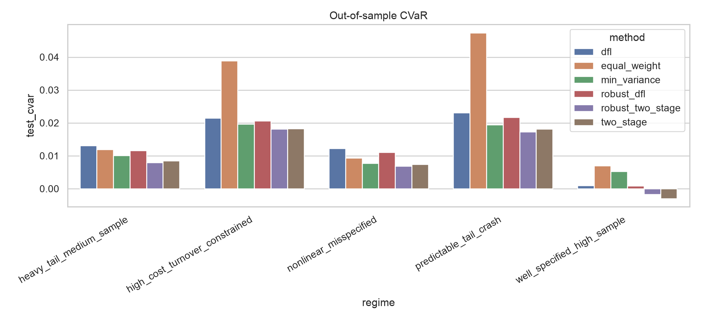
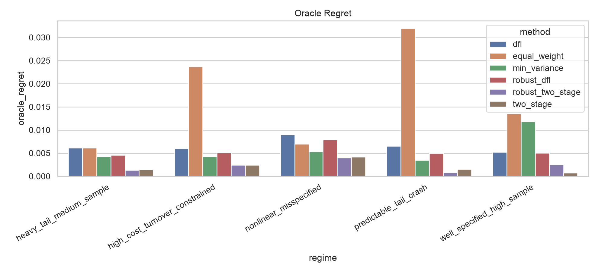

# When Does End-to-End Learning Help Tail-Risk Portfolio Construction?

[](LICENSE)


Simulation comparing decision-focused learning (train the forecast through the optimizer, on decision loss) with predict-then-optimize (fit returns, then solve a CVaR program) for 95% CVaR portfolios.

The setup is built so an oracle — the same optimizer, given the true conditional return distribution — is computable. Methods are scored on regret against that oracle, not on a Sharpe that depends on which decade you sampled.

## Result

Estimate-then-optimize has the lowest out-of-sample 95% CVaR and the lowest oracle regret in all five regimes, including two where forecast misspecification would be expected to help end-to-end training. The two two-stage variants take the top two slots of six methods every time.

Best two-stage vs. best DFL, paired by seed (lower is better):

| Regime | true-mean linear R² | best two-stage | best DFL | ratio | paired *t* | seeds won |
|---|---:|---:|---:|---:|---:|:---:|
| `well_specified_high_sample` | 0.93 | **−0.00299** | 0.00086 | — | 8.42 | 5/5 |
| `heavy_tail_medium_sample` | 0.93 | **0.00796** | 0.01158 | 1.45× | 2.29 | 5/5 |
| `nonlinear_misspecified` | 0.45 | **0.00692** | 0.01108 | 1.60× | 4.94 | 5/5 |
| `predictable_tail_crash` | 0.80 | **0.01725** | 0.02167 | 1.26× | 5.19 | 5/5 |
| `high_cost_turnover_constrained` | 0.60 | **0.01817** | 0.02066 | 1.14× | 2.12 | 4/5 |

Out-of-sample 95% CVaR, mean over 5 seeds. Per-seed rows: [`outputs/research_grid_v2/results_by_seed.csv`](outputs/research_grid_v2/results_by_seed.csv). Oracle-regret ranking is the same in all five regimes (paired *t* = 2.02–9.46).

<p align="center">
  
  
</p>

At n = 500–900 periods and 25 assets, estimation error dominates the mismatch between training loss and decision loss. The gradient through a smoothed CVaR argmin is too noisy to help at this sample size. That is about this regime, not about DFL in general.

## Audit

The first version had the same ranking with much larger gaps ("2–3× worse"). Three bugs, two of which favored that conclusion:

| # | Defect | Effect | Fix |
|---|---|---|---|
| 1 | `dfl_smooth_tau = 0.01` was the same order as the per-period loss sd | Softplus so wide that only 6.8–41% of the DFL gradient landed on the true worst 5%. In four regimes the "CVaR" objective was a smeared mean loss — a 5.7× biased CVaR estimate. | τ → `1e-4` (92.9–98.0% of gradient weight on the tail) |
| 2 | `misspecification_strength` scaled an L2-normalized loading vector | Nonlinear term ~5× weaker than nominal. "Misspecified" regimes had true-mean linear R² of 0.916 and 0.931. | strength → 8 / 15 / 5 (R² 0.45 / 0.80 / 0.60) |
| 3 | Oracle solved with 1200 scenarios vs. 300 for everyone else | Oracle saw 60 tail scenarios to everyone else's 15, so "oracle regret" mixed estimation error with Monte Carlo error. | oracle → 300 |

Two metric bugs as well: Sortino hit a `/1e-12` divide-by-zero (~1e10 values), and `tail_loss_frequency` compared each series to its own quantile, so it was identical across methods by construction.

Fixing τ improved DFL's own test CVaR by 26–77%. The gap fell from 2–3× to 1.14–1.60×. The ranking did not change.

A re-run from unmodified v1 code, 10 seeds, six (τ × misspec) arms still has two-stage winning every regime. Sharper τ helps DFL monotonically (regret ratio 7.19 → 3.69 as τ goes 1e-2 → 1e-5 in the well-specified regime) and never flips the ranking. Hardening misspecification narrows the gap mostly by making two-stage worse, not by helping DFL.

Full numbers: [`RESULTS_v2.md`](RESULTS_v2.md).

## Methods

95% CVaR as a Rockafellar–Uryasev LP ([`optimizer.py`](src/tailrisk_dfl/optimizer.py)): long-only, fully invested, 20% position cap, mean-return tilt γ, ℓ₁ turnover penalty in the objective and again in the backtest, optional hard turnover constraint. Solved with HiGHS.

Six methods share that decision layer:

| method | what it is |
|---|---|
| `equal_weight` | 1/N |
| `min_variance` | Ledoit–Wolf shrinkage covariance + SLSQP |
| `two_stage` | multi-output ridge → residual bootstrap scenarios → CVaR LP |
| `robust_two_stage` | same, with mean shrinkage (0.6×) and tail-tilted residual resampling |
| `dfl` | MLP → softmax weights, trained on a softplus-smoothed CVaR surrogate |
| `robust_dfl` | same, trained at a stricter α (+0.025) |
| `oracle` | CVaR LP given the true conditional distribution |

Generator ([`synthetic.py`](src/tailrisk_dfl/synthetic.py)): SNR, Student-*t* tails, skew, factor / block / crisis correlation, nonlinear or hidden-crash misspecification, crash probability, costs from 5 to 50 bps.

## Reproduce

```bash
pip install -e .
```

```bash
OMP_NUM_THREADS=1 python scripts/run_experiment.py --config configs/smoke.json --output outputs/smoke
```

Smoke finishes in a few minutes on the same code path. Full grid:

```bash
OMP_NUM_THREADS=1 python scripts/run_experiment.py --config configs/research_grid_v2.json --output outputs/research_grid_v2 --plots
```

```bash
pytest
```

`OMP_NUM_THREADS=1` is required. Without it, torch and numpy contend over OpenMP and the run segfaults (exit 139). On `scikit-learn` 1.0.x with `scipy` ≥ 1.11 you will also hit the removed `scipy.linalg.solve(sym_pos=)` argument — use a current scikit-learn.

## Limitations

- Synthetic data only. Oracle regret needs the true conditional law, which you cannot get from historical prices. Nothing here is evidence about real markets.
- One hyperparameter setting per method. Only τ was corrected; no learning-rate or width sweep for DFL.
- Two-stage methods get `prev_weights` and the turnover constraint at decision time; the DFL policy is stateless and only sees a turnover proxy in training. Treat `high_cost_turnover_constrained` as indicative.
- Two cells are weak: `high_cost` on CVaR (*t* = 2.12, 4/5 seeds) and `heavy_tail` on regret (*t* = 2.02, 3/5 seeds).
- The split is 75/25, not the advertised 60/15/25. Validation is concatenated into training ([`experiment.py`](src/tailrisk_dfl/experiment.py)) and unused. Left as-is; a later pass should spend it on DFL hyperparameter selection.
- `predictable_tail_crash` has an R² floor near 0.71–0.80: the tanh basis saturates.

## Layout

```
src/tailrisk_dfl/
  synthetic.py     return generator
  optimizer.py     Rockafellar–Uryasev CVaR LP, min-variance, capped-simplex projection
  baselines.py     equal weight, min-variance, two-stage, robust two-stage
  dfl.py           smoothed-CVaR end-to-end learner
  experiment.py    walk-forward runner
  evaluation.py    test CVaR, oracle regret, turnover, drawdown, tail-loss frequency
configs/           smoke.json · research_grid.json (v1) · research_grid_v2.json
outputs/           committed result sets and plots
RESULTS_v2.md              current numbers
RESULTS_v1_superseded.md   pre-audit numbers
research_notes.md          iteration log
```

## License

MIT. See [LICENSE](LICENSE).
