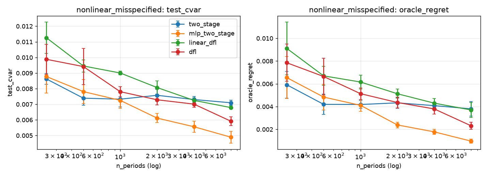

# v3: why does DFL lose? A 2×2 ablation and a sample-size curve

v2 established *that* two-stage beats DFL in all five regimes. It could not say
*why*, because `dfl` differs from `two_stage` in two things at once: the training
objective (smoothed CVaR vs MSE) and the model class (MLP vs ridge). v3 separates
them, spends the validation block that v2 left unused, and asks how much data DFL
needs before it catches up.

All numbers are means over the same 5 seeds as v2 (same synthetic paths).
Lower is better. Paired *t* is over seeds; "wins" is seeds where the first
method beat the second. Full tables: `outputs/research_grid_v3/analysis.txt`,
`outputs/sample_size_curve/analysis.txt`.

## What changed in the protocol

- `use_validation: true`. Torch-trained methods (`dfl`, `robust_dfl`, `linear_dfl`,
  `dfl_stateful`, `mlp_two_stage`) select (lr ∈ {0.001, 0.005, 0.02}, hidden ∈ {16, 64},
  epoch by early stopping with patience 30) on the 15% validation block, then refit
  on train+val for the selected epoch count. Ridge and min-variance get train+val
  directly, as in v2. So every method sees the same 75% of rows at the end.
- Three new methods, all sharing the v2 optimizer and backtest:

| method | model class | objective | what it isolates |
|---|---|---|---|
| `two_stage` | ridge | MSE → bootstrap → CVaR LP | reference |
| `linear_dfl` | linear → softmax | smoothed CVaR | **objective axis** (same capacity as ridge) |
| `mlp_two_stage` | MLP (same net as `dfl`) | MSE → bootstrap → CVaR LP | **model-class axis** (same capacity as DFL) |
| `dfl` | MLP → softmax | smoothed CVaR | both |
| `dfl_stateful` | MLP → softmax, input includes w_{t−1} | smoothed CVaR, real path turnover | turnover confound |

## Result 1: the objective is the problem, not the model class

Objective axis, `linear_dfl` vs `two_stage` (same linear capacity; test CVaR):

| regime | linear_dfl | two_stage | ratio | paired *t* | wins |
|---|---:|---:|---:|---:|:---:|
| well_specified_high_sample | 0.00107 | −0.00299 | — | 14.0 | 0/5 |
| heavy_tail_medium_sample | 0.01299 | 0.00849 | 1.53× | 8.4 | 0/5 |
| nonlinear_misspecified | 0.00945 | 0.00739 | 1.28× | 7.9 | 0/5 |
| predictable_tail_crash | 0.03258 | 0.01817 | 1.79× | 4.4 | 0/5 |
| high_cost_turnover_constrained | 0.03112 | 0.01829 | 1.70× | 3.9 | 0/5 |

Model-class axis, `mlp_two_stage` vs `two_stage` (same MSE + LP pipeline):

| regime | mlp_two_stage | two_stage | ratio | paired *t* | wins |
|---|---:|---:|---:|---:|:---:|
| well_specified_high_sample | −0.00226 | −0.00299 | — | 4.4 | 0/5 |
| heavy_tail_medium_sample | 0.00865 | 0.00849 | 1.02× | 0.4 | 2/5 |
| nonlinear_misspecified | 0.00781 | 0.00739 | 1.06× | 1.0 | 2/5 |
| predictable_tail_crash | 0.01886 | 0.01817 | 1.04× | 1.8 | 1/5 |
| high_cost_turnover_constrained | 0.01769 | 0.01829 | 0.97× | −2.2 | 4/5 |

Swapping ridge for an MLP costs almost nothing (and helps slightly in the
turnover-constrained regime). Swapping MSE for the CVaR objective, holding the
model class fixed at linear, costs 28–79% in every regime, 0/5 seeds. The whole
v2 gap sits on the objective axis.

The reading: MSE uses every training row to pin down the conditional mean, and
the residual bootstrap then hands the LP a full distribution. The CVaR objective
only gets gradient from the ~5% of rows past the smoothed quantile, so at
n = 375–675 it is fitting a 25-asset policy from roughly 20–35 observations.
This is the "estimate-then-optimize wins when the estimation problem is easy"
regime of Hu, Kallus & Mao (2022) and Elmachtoub, Lam, Zhang & Zhao (2023),
and it holds here even under misspecification because the misspecification is
mild relative to the tail-sample noise.

## Result 2: early stopping helps DFL 13–25%, ranking unchanged

`dfl` v3 (val-selected) vs `dfl` v2 (fixed 250 epochs, lr 0.005, hidden 64), same data:

| regime | dfl v3 | dfl v2 | ratio | paired *t* | wins |
|---|---:|---:|---:|---:|:---:|
| well_specified_high_sample | 0.00073 | 0.00097 | 0.75× | −0.6 | 3/5 |
| heavy_tail_medium_sample | 0.00992 | 0.01315 | 0.75× | −8.4 | 5/5 |
| nonlinear_misspecified | 0.00942 | 0.01224 | 0.77× | −2.7 | 5/5 |
| predictable_tail_crash | 0.02015 | 0.02314 | 0.87× | −2.1 | 4/5 |
| high_cost_turnover_constrained | 0.01859 | 0.02152 | 0.86× | −3.7 | 5/5 |

So v2's DFL was over-trained, and the v2 caveat "one hyperparameter setting per
method" was costing DFL a real amount. Selected epochs are mostly 15–140, well
under 250. Even so, `dfl` vs `two_stage` is now 1.02–1.27× instead of
1.14–1.60×, and two-stage still wins 4 of 5 regimes on CVaR (the
turnover-constrained cell is a coin flip: *t* = 0.9, 3/5 for DFL).

## Result 3: giving DFL the previous weights does nothing

`dfl_stateful` vs `dfl`: ratios 0.73–1.01×, |*t*| ≤ 1.3, 3–4/5 seeds. Directionally
better in four regimes but not distinguishable at 5 seeds, and no better in the
turnover-constrained regime it was built for. The turnover confound from the v2
caveats is not what drives the gap.

## Result 4: DFL crosses over at n ≈ 2000, but MLP two-stage crosses earlier and by more

`nonlinear_misspecified` regime, n_periods ∈ {250 … 8000}, 5 seeds, test CVaR:

| n | two_stage | mlp_two_stage | linear_dfl | dfl |
|---:|---:|---:|---:|---:|
| 250 | 0.00862 | 0.00878 | 0.01126 | 0.00988 |
| 500 | 0.00739 | 0.00781 | 0.00945 | 0.00942 |
| 1000 | 0.00733 | 0.00725 | 0.00900 | 0.00781 |
| 2000 | 0.00758 | **0.00611** | 0.00807 | 0.00729 |
| 4000 | 0.00730 | **0.00556** | 0.00725 | 0.00701 |
| 8000 | 0.00710 | **0.00489** | 0.00679 | 0.00592 |

Paired against `two_stage`: `dfl` wins 5/5 at n = 8000 (*t* = −3.5, 0.83×) and is
ahead on the mean from n = 2000. `linear_dfl` also catches up by n = 4000–8000.
`mlp_two_stage` pulls ahead from n = 2000 (*t* = −4.5, 5/5) and is 0.69× at
n = 8000 (*t* = −5.1). Ridge two-stage plateaus at ≈ 0.0071–0.0076 from n = 1000
on: it has hit its misspecification floor.



So, in this regime:

1. Misspecification is real: the linear forecaster stops improving at n ≈ 1000.
2. The cure is capacity, not the objective. An MLP with the ordinary MSE +
   bootstrap + LP pipeline uses the extra data best.
3. DFL does eventually beat ridge two-stage, but it needs ~4× more data than
   MLP two-stage to do so, and never catches MLP two-stage in this range.

## Caveats specific to v3

- The DFL here is still a direct policy (softmax head), not a
  differentiate-through-the-LP method. A true SPO+ / cvxpylayers variant might
  sit between `mlp_two_stage` and `dfl`, since it would use every row for the
  forecast and only the decision loss for the tilt. That is the natural next
  experiment.
- The sample-size curve is one regime. The crossover point will move with
  SNR, tail df and misspecification strength.
- Validation is 15% of n, so at n = 500 the early-stopping signal is 75 rows
  (about 4 tail rows). The 5-seed spread in selected epochs (15–177) shows that.
- `dfl_stateful` is trained by sequential rollout with detached previous
  weights, i.e. no gradient through the path. It is ~10× slower than `dfl`.

## Reproduce

```bash
OMP_NUM_THREADS=1 python scripts/run_experiment.py --config configs/research_grid_v3.json --output outputs/research_grid_v3 --plots
OMP_NUM_THREADS=1 python scripts/run_experiment.py --config configs/sample_size_curve.json --output outputs/sample_size_curve
python scripts/analyze_v3.py outputs/research_grid_v3 outputs/research_grid_v2
python scripts/analyze_v3.py --curve outputs/sample_size_curve
```

About 45 min and 15 min respectively on 1 core.
