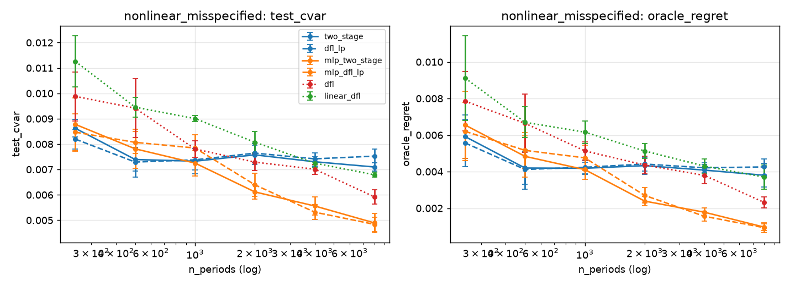

# v4: a DFL that actually differentiates through the LP

v3 showed the v2 gap sits on the objective axis: a softmax policy trained on a
smoothed CVaR loses to MSE + bootstrap + LP even with the same linear capacity.
But that softmax policy never touches the optimizer, so v3 could not say
whether *decision-focused learning* loses, or just *that particular way of
doing it*. v4 adds the real thing.

## Method

`dfl_lp` (linear forecaster) and `mlp_dfl_lp` (same MLP as `dfl`):

```
x --f_θ--> μ(x) --(+ bootstrap residuals)--> 50 scenarios --CVaR LP layer--> w
loss = smoothed 95% CVaR of realized w·r over a 256-row minibatch  −  γ·mean
```

- The LP layer is the Rockafellar–Uryasev LP from `optimizer.py` rebuilt in
  cvxpylayers (Clarabel), with a small quadratic term `1e-3·‖w‖²` in the
  training layer only. Without it the LP argmin is piecewise constant in μ and
  the gradient norm is ~1e-6; with it ~1e-2 and the training loss falls
  steadily (QPTL, Wilder et al. 2019).
- f_θ is warm-started from the MSE fit, i.e. from `two_stage` / `mlp_two_stage`.
  Residuals for the bootstrap come from that fit and are held fixed, with a
  fixed scenario draw per row (common random numbers) so the objective is
  deterministic in θ.
- Fine-tune up to 30 epochs, lr ∈ {1e-3, 5e-3} and epoch chosen on the
  validation block, refit on train+val. If validation never improves on the
  MSE init, the selected epoch is 0 and the method *is* two-stage.
- At decision time: the exact HiGHS LP `two_stage` uses, 300 scenarios,
  previous weights, turnover penalty. Only the forecaster differs.

So `dfl_lp` vs `two_stage` isolates one thing: was the forecaster fine-tuned
on decision loss or not. It is "estimate-then-optimize init, integrated
fine-tune", which is the recipe the theory papers recommend.

## Result 1: through-the-LP DFL recovers two-stage, and crushes the softmax policy

Test CVaR, 5 seeds, same paths as v2/v3. Lower is better.

| regime | two_stage | dfl_lp | ratio | *t* | wins | linear_dfl (v3) |
|---|---:|---:|---:|---:|:---:|---:|
| well_specified_high_sample | −0.00299 | −0.00271 | 0.91 | 0.8 | 2/5 | 0.00107 |
| heavy_tail_medium_sample | 0.00849 | 0.00828 | 0.98 | −0.4 | 3/5 | 0.01299 |
| nonlinear_misspecified | 0.00739 | 0.00729 | 0.99 | −0.3 | 3/5 | 0.00945 |
| predictable_tail_crash | 0.01817 | 0.01913 | 1.05 | 1.5 | 1/5 | 0.03258 |
| high_cost_turnover_constrained | 0.01829 | 0.01789 | 0.98 | −1.1 | 3/5 | 0.03112 |

`dfl_lp` is statistically indistinguishable from `two_stage` everywhere
(|*t*| ≤ 1.5), ranks 1st in three regimes on mean CVaR, and is 0.57–0.77× the
softmax-policy `linear_dfl` with 5/5 seeds in every regime. Same linear
capacity, same CVaR objective, same data. The v2/v3 "DFL loses by 1.3–1.8×"
result was about the softmax policy, not about training on decision loss.

Why the difference: the softmax policy learns 25 weights per row from the
~5% tail rows alone. `dfl_lp` starts from a forecaster that used every row,
and the LP supplies the constraint structure (simplex, cap, tail averaging)
for free, so the gradient only has to move μ a little.

## Result 2: with the MLP, fine-tuning through the LP does not help at n ≈ 500

| regime | mlp_two_stage | mlp_dfl_lp | ratio | *t* | wins |
|---|---:|---:|---:|---:|:---:|
| well_specified_high_sample | −0.00226 | −0.00247 | 1.09 | −1.2 | 4/5 |
| heavy_tail_medium_sample | 0.00865 | 0.01111 | 1.29 | 3.5 | 0/5 |
| nonlinear_misspecified | 0.00781 | 0.00807 | 1.03 | 0.6 | 2/5 |
| predictable_tail_crash | 0.01886 | 0.01948 | 1.03 | 0.9 | 2/5 |
| high_cost_turnover_constrained | 0.01769 | 0.01922 | 1.09 | 6.9 | 0/5 |

Neutral in three regimes, clearly worse in the heavy-tail and high-cost
regimes. An MLP has enough freedom to move μ a lot in the direction the
~20-row training tail wants, and the 75-row validation block (≈4 tail rows)
is too small to stop it reliably.

## How often did fine-tuning do anything?

Selected fine-tune epochs (0 = validation never beat the MSE init):

| regime | dfl_lp | mlp_dfl_lp |
|---|---|---|
| well_specified_high_sample | 5, 0, 9, 1, 3 | 0, 5, 4, 0, 0 |
| heavy_tail_medium_sample | 14, 10, 0, 0, 5 | 14, 1, 7, 1, 2 |
| nonlinear_misspecified | 15, 3, 2, 4, 3 | 3, 0, 0, 2, 3 |
| predictable_tail_crash | 0, 1, 0, 1, 5 | 0, 0, 0, 0, 3 |
| high_cost_turnover_constrained | 25, 6, 0, 0, 9 | 2, 1, 2, 0, 1 |

28% of `dfl_lp` cells and 40% of `mlp_dfl_lp` cells selected 0 epochs. In the
crash regime, fine-tuning almost never helped on validation. So at this
sample size the honest summary of true DFL is: "usually a no-op, occasionally a
small gain, occasionally a small loss, net zero against two-stage".

## Result 3: sample-size curve. Through-the-LP fine-tuning tracks its own forecaster's curve

`nonlinear_misspecified`, n_periods ∈ {250 … 8000}, 5 seeds, test CVaR.
Solid = MSE forecaster, dashed = same forecaster fine-tuned through the LP.

| n | two_stage | dfl_lp | mlp_two_stage | mlp_dfl_lp | dfl (softmax, v3) |
|---:|---:|---:|---:|---:|---:|
| 250 | 0.00862 | 0.00819 | 0.00878 | 0.00847 | 0.00988 |
| 500 | 0.00739 | 0.00729 | 0.00781 | 0.00807 | 0.00942 |
| 1000 | 0.00733 | 0.00738 | 0.00725 | 0.00785 | 0.00781 |
| 2000 | 0.00758 | 0.00764 | 0.00611 | 0.00640 | 0.00729 |
| 4000 | 0.00730 | 0.00742 | 0.00556 | **0.00532** | 0.00701 |
| 8000 | 0.00710 | 0.00753 | 0.00489 | 0.00484 | 0.00592 |



- `dfl_lp` vs `two_stage`: 0.95–1.06×, |*t*| ≤ 1.4 at every n. The linear
  forecaster hits its misspecification plateau at n ≈ 1000 and fine-tuning
  through the LP cannot lift it off: the decision loss can only tilt a
  linear μ, and the linear μ is the problem.
- `mlp_dfl_lp` vs `mlp_two_stage`: one significant cell, n = 4000 (0.96×,
  *t* = −3.1, 5/5). Everything else is a wash. At n = 8000 both sit at 0.0048–0.0049.
- `mlp_dfl_lp` vs the softmax `dfl`: 0.76–0.82× at n ≥ 4000, 5/5, *t* = −5.6 and
  −11.2. Same MLP, same CVaR loss; routing it through the LP is what matters.

## What the four versions add up to

| question | answer | evidence |
|---|---|---|
| Does two-stage beat DFL at n ≈ 500? | Yes, if DFL means a softmax policy. No, if it means fine-tuning through the LP: they tie. | v2/v3 ranks; v4 Result 1 |
| Is the gap objective or model class? | Objective, but specifically *how* the objective reaches the parameters. Same CVaR loss through the LP loses nothing. | v3 2×2; v4 `dfl_lp` vs `linear_dfl` |
| When does misspecification bite? | n ≳ 1000: the linear forecaster plateaus. | v3/v4 curves |
| What fixes it? | Forecaster capacity (MLP + ordinary MSE). Decision-loss fine-tuning adds ≤ 4% on top and only sometimes. | v3 Result 4; v4 Result 3 |
| Is a validation block worth having? | Yes: it saved DFL 13–25% in v3 and it is what keeps `mlp_dfl_lp` from overfitting the training tail in v4. | v3 Result 2; v4 epochs table |

The clean one-liner: in this simulator, a CVaR portfolio needs a good
conditional-mean forecaster far more than it needs a decision-aware loss. When
the forecaster is right, decision-focused fine-tuning is a no-op. When it is
wrong, the cure is a better forecaster, and decision-focused fine-tuning on a
wrong forecaster is still a no-op.

## Caveats specific to v4

- Only the conditional mean is learned end-to-end. The scenario *spread*
  comes from fixed MSE residuals. A DFL that also learns the residual
  distribution (or the scenario weights) could in principle do more with the
  tail; that is the natural v5.
- The training layer differs from the decision LP in three ways: 50 instead of
  300 scenarios, a `1e-3·‖w‖²` regulariser, and no turnover term (prev weights
  are equal-weight in training). These were chosen for speed and gradient
  quality, not tuned.
- The validation block is 15% of n. At n = 500 that is 75 rows and ≈ 4 tail
  rows, which is why the selected epoch counts are so jumpy.
- Wall clock: `dfl_lp` and `mlp_dfl_lp` are ~50× slower to fit than `two_stage`
  (about 40 s per regime/seed at n = 500 on one core, ~10 min at n = 8000).

## Reproduce

```bash
pip install -e .   # now pulls cvxpy + cvxpylayers
for i in 0 1 2 3 4; do OMP_NUM_THREADS=1 python scripts/run_parts.py --config configs/research_grid_v4.json --output outputs/research_grid_v4 --regime-index $i & done; wait
python scripts/run_parts.py --merge --output outputs/research_grid_v4
for i in 0 1 2 3 4 5; do OMP_NUM_THREADS=1 python scripts/run_parts.py --config configs/sample_size_curve_lp.json --output outputs/sample_size_curve_lp --regime-index $i & done; wait
python scripts/run_parts.py --merge --output outputs/sample_size_curve_lp
python scripts/analyze_v3.py --lp outputs/research_grid_v4 outputs/research_grid_v3
python scripts/analyze_v3.py --curve outputs/sample_size_curve outputs/sample_size_curve_lp
pytest
```

About 25 min for the grid and 90 min for the curve on 4 cores.
